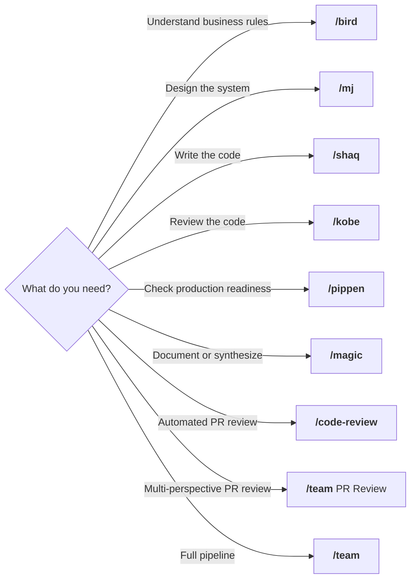
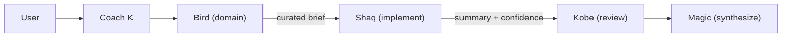
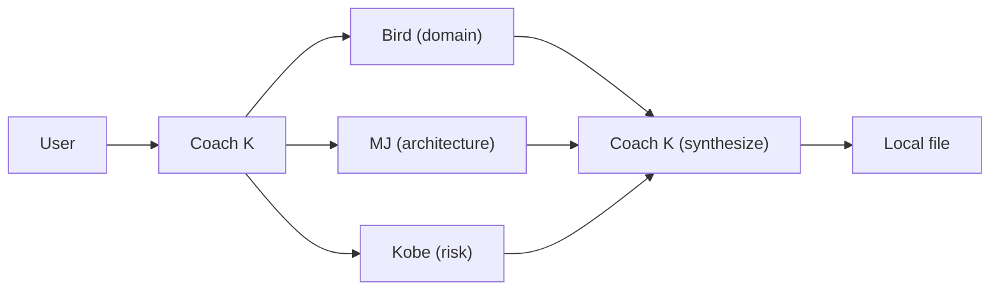
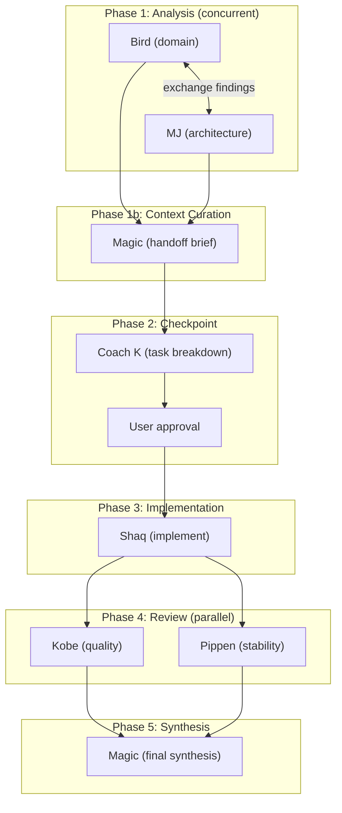

# Dream Team

Source of truth for all Claude Code agents and commands. Install once, use everywhere.

## What's in the box

**6 agents**, each with a matching `/command`, plus a `/team` orchestrator and `/code-review` for automated PR reviews.

| Agent | Command | Persona | Role | Model | Max Turns |
|-------|---------|---------|------|-------|-----------|
| **bird** | `/bird` | Larry Bird | Domain Authority & Final Arbiter | **opus** | 50 |
| **mj** | `/mj` | Michael Jordan | Strategic Systems Architect | **opus** | 50 |
| **shaq** | `/shaq` | Shaquille O'Neal | Primary Code Executor | **opusplan** | 100 |
| **kobe** | `/kobe` | Kobe Bryant | Quality & Risk Enforcer | **opus** | 50 |
| **pippen** | `/pippen` | Scottie Pippen | Stability, Integration & Defense | **opus** | 50 |
| **magic** | `/magic` | Magic Johnson | Context Synthesizer & Team Glue | sonnet | 50 |

### Agent capabilities

Each agent has restricted tool access based on its role:

| Agent | Tools | Why |
|-------|-------|-----|
| bird | Read, Grep, Glob, Bash | Domain analysis + business impact assessment |
| mj | Read, Grep, Glob, Bash, WebFetch, WebSearch | Architecture + external research + health diagnostics |
| shaq | All except Task | Full implementer — writes code |
| kobe | Read, Grep, Glob, Bash, Edit | Quality review + can fix critical bugs directly |
| pippen | Read, Grep, Glob, Bash | Stability review — checks runtime |
| magic | Read, Grep, Glob, Write, Edit | Synthesis + writes handoff briefs and retros to disk |

Agents with `memory: user` (kobe, magic) learn across sessions — remembering review patterns, failure modes, and past decisions.

### Key agent features

Every agent includes these cross-cutting capabilities:

- **Output Schema** — structured required fields that Coach K validates before handoffs. Prevents the #1 multi-agent failure mode: agents talking past each other due to freeform outputs.
- **Escalation Protocol** — agent-specific rules for when to stop and ask instead of guessing. Each agent knows what kinds of uncertainty warrant escalation to Coach K.
- **Confidence Assessment** — self-reported confidence level (0-100%), high/low confidence areas, and assumptions. Helps Coach K and downstream agents calibrate trust.
- **Turn Budget Management** — hard limits: stop research at ~70% of turns and write output. Prevents agents from spending all turns on research without delivering.

## When to use what



| Command | When to reach for it | Examples |
|---------|---------------------|----------|
| `/bird` | Validate business logic or define what "right" looks like | "Are these pricing rules correct?", "Define acceptance criteria for checkout" |
| `/mj` | Architecture decisions, system design, or health diagnostics | "Should we use event sourcing or CRUD?", "Diagnose our API latency" |
| `/shaq` | Clear spec, need code written | "Implement this endpoint per the spec", "Write tests for discount calc" |
| `/kobe` | Code is written, need ruthless quality review | "This handles money — find every way it could break" |
| `/pippen` | Verify operational readiness | "Do we have enough logging to debug at 3am?" |
| `/magic` | Synthesize perspectives into docs/ADRs | "Document why we chose event sourcing" |
| `/team` | Task too big for one agent | "Build a real-time notification system" |
| `/code-review` | Automated PR review | "/code-review 42" |

## /team — Coach K Orchestration

The `/team` command launches Coach K, who coordinates the Dream Team. Three modes:

### Quick Fix — Subagents (within session)

For bug fixes, small features, and focused changes. Sequential subagents, lower token cost.



1. **Bird** defines business rules and acceptance criteria (with output schema)
2. **Coach K** curates a focused brief for Shaq — only the domain rules, acceptance criteria, and terms needed
3. **Shaq** implements the code with tests, maps back to Bird's acceptance criteria
4. **Kobe** reviews for critical risks, guided by Shaq's low-confidence areas
5. **Magic** synthesizes everything with team metrics

Coach K curates context per agent rather than dumping all prior outputs. This prevents context bloat while ensuring each agent has exactly what they need.

**Fix-Verify Loop:** If Kobe reports findings, Coach K re-launches Shaq to fix, then Kobe to verify. No fixes are ever skipped.

### PR Review — Subagents (parallel, local output)

For reviewing PRs or branches. 3 agents in parallel, all output stays local.



1. **Coach K** fetches PR data using read-only `gh` commands
2. **Bird + MJ + Kobe** review the diff in parallel
3. **Coach K** synthesizes verdicts and writes to `analysis/PR-<number>-review.md`

All `gh` commands are **READ-ONLY**. Nothing is ever posted to GitHub.

### Full Team — Agent Team (parallel sessions)

For new features, architecture changes, and complex multi-file work. Uses [agent teams](https://code.claude.com/docs/en/agent-teams) — 6 independent sessions coordinated by Coach K.



| Phase | Agents | What happens |
|-------|--------|-------------|
| **1. Analysis** | Bird + MJ (concurrent) | Bird defines domain rules while MJ designs architecture. They exchange findings via messages and adjust in real-time. |
| **1b. Context Curation** | Magic | Creates a curated handoff brief for Shaq — resolves terminology mismatches, flags contradictions, distills only what's needed for implementation. |
| **2. Checkpoint** | Coach K + User | Coach K saves checkpoint to `analysis/checkpoint-<topic>.md`, breaks work into tasks, presents plan. User approves before implementation. |
| **3. Implementation** | Shaq | Implements from Magic's handoff brief. Must submit plan before writing code (plan mode enforced). Maps implementation back to acceptance criteria. |
| **4. Review** | Kobe + Pippen (parallel) | Kobe reviews quality/risk, Pippen reviews stability/ops. Both receive curated context, not raw dumps. |
| **4b. Fix-Verify** | Shaq → Kobe + Pippen | If reviewers find issues, Shaq fixes, then reviewers re-verify. Loop repeats until both say SHIP. |
| **5. Synthesis** | Magic | Final synthesis with team metrics: escalation count, confidence levels, finding attribution, fix-verify loop count. |

**Checkpointing:** Phase 1-2 outputs are saved to disk. If Phase 3 fails, earlier work is preserved — no need to re-run analysis.

**Escalation handling:** When any agent escalates (domain ambiguity, spec conflicts, missing context), Coach K routes to the right specialist or asks the user directly. Escalations are tracked in the retro.

**Requirements:**
- Enable `CLAUDE_CODE_EXPERIMENTAL_AGENT_TEAMS` in settings.json or environment
- If not enabled, Coach K falls back to Quick Fix subagent workflow

### Session Recordings

Every `/team` session (all modes) is recorded as an [asciicast v3](https://docs.asciinema.org/manual/asciicast/v3/) file with navigable markers at key moments:

- Phase transitions, agent spawns/completions, human decisions, escalations, fix-verify loops
- Uploaded to asciinema (unlisted) at session end — link saved to the retro
- Local file saved to `docs/recordings/YYYY-MM-DD-<topic>.cast`

The recording is constructed programmatically via `scripts/cast.sh` — it captures the team workflow narrative, not raw terminal output.

### Retrospectives

After every `/team` session, Magic produces a mandatory retrospective saved to `docs/retros/YYYY-MM-DD-<topic>.md`:

- Executive summary, findings table, agent contributions
- **Team metrics:** escalation count, confidence levels per agent, finding attribution, fix-verify loop count, contradictions detected
- **Session recording** link (asciinema URL or local path)
- Carry-forward items and process lessons

### Git Safety

No agent ever commits or pushes. The user controls all git operations. Suggested git commands are provided in the final output.

## /code-review — Automated PR Review

Based on the [official Claude Code code-review plugin](https://github.com/anthropics/claude-code/tree/main/plugins/code-review), adapted for local-only output.

Launches 4+ parallel agents:
- **2x CLAUDE.md compliance agents** — check guideline adherence
- **2x bug detector agents** — find bugs and security issues in the diff
- **Validation agents** — verify each finding is real (reduces false positives)

All output stays in the terminal. Nothing is ever posted to GitHub.

```
/code-review 42        # Review PR #42
/code-review           # Review current branch's PR
```

## Installation

### 1. Clone and install

```bash
git clone <this-repo> ~/Github/Bondarewicz/dreamteam
cd ~/Github/Bondarewicz/dreamteam
./scripts/install.sh
```

The installer backs up existing files, then copies all agents to `~/.claude/agents/` and commands to `~/.claude/commands/`.

### 2. Enable agent teams (optional, for Full Team mode)

Add to `~/.claude/settings.json`:

```json
{
  "env": {
    "CLAUDE_CODE_EXPERIMENTAL_AGENT_TEAMS": "1"
  }
}
```

### 3. Restart Claude Code

Start a new session to pick up changes. After any edit, run `./scripts/install.sh` again.

## Repository Structure

```
dreamteam/
├── agents/                    # Agent definitions (6 files)
│   ├── bird.md                # Domain authority & business impact
│   ├── mj.md                  # Systems architect & health diagnostics
│   ├── shaq.md                # Code executor
│   ├── kobe.md                # Quality enforcer & production readiness
│   ├── pippen.md              # Stability & integration
│   └── magic.md               # Context synthesizer & handoff curator
├── commands/                  # Slash commands (8 files)
│   ├── bird.md, mj.md, shaq.md, kobe.md, pippen.md, magic.md
│   ├── team.md                # /team (Coach K orchestrator)
│   └── code-review.md         # /code-review (automated PR review)
├── scripts/
│   ├── install.sh             # Installer script
│   └── cast.sh                # Asciicast v3 recording helper
├── docs/
│   ├── team-improvement-analysis.md  # Gap analysis with sources
│   ├── claude-skillz-analysis.md     # Transferable patterns analysis
│   ├── recordings/                   # Session recordings (.cast files)
│   └── retros/                       # Session retrospectives
└── README.md
```

## Models & Tuning

### Model strategy

Quality-first, with each agent on the model matching its reasoning demands.

| Model | Agents | Why |
|-------|--------|-----|
| **opus** | bird, mj, kobe, pippen | Domain analysis, architecture, quality review, and stability review all require deep reasoning |
| **opusplan** | shaq | Opus for planning, sonnet for code generation |
| **sonnet** | magic | Synthesis is structured and doesn't need opus depth |

### Tuning guide

| If you notice... | Try... |
|-----------------|--------|
| Magic's synthesis is fine but slow | Downgrade magic to `haiku` |
| Hitting rate limits on Full Team | Downgrade bird, mj to `sonnet` |
| Kobe's findings are obvious/shallow | Keep on `opus` — quality is where depth matters most |
| Pippen's reviews are excellent | Could downgrade to `sonnet` to save rate limits |
| Shaq's code quality is great | Could downgrade to `sonnet` (saves opus planning cost) |

To change a model: edit `model:` in `agents/<name>.md`, run `./scripts/install.sh`.

### Turn limits

| Agent | maxTurns | Rationale |
|-------|----------|-----------|
| bird | 50 | Domain analysis — finishes in ~26 turns |
| mj | 50 | Architecture — finishes in ~28 turns |
| shaq | 100 | Implementation — writes code, runs tests, iterates |
| kobe | 50 | Quality review — hard stop at turn 25 for output |
| pippen | 50 | Stability review — matches analysis budget |
| magic | 50 | Synthesis — reads outputs and writes summary |

### Usage monitoring

Coach K includes a **Lineup Card** at the end of every `/team` run. Use `/usage` before and after a session to see rate limit impact.

## Built-in Tension (by design)

The Dream Team has intentional creative tension:

- **Bird vs MJ** — correctness vs elegance
- **Kobe vs Shaq** — quality vs speed
- **Coach K vs everyone** — shipping vs perfection

This tension prevents groupthink and ensures robust solutions.
