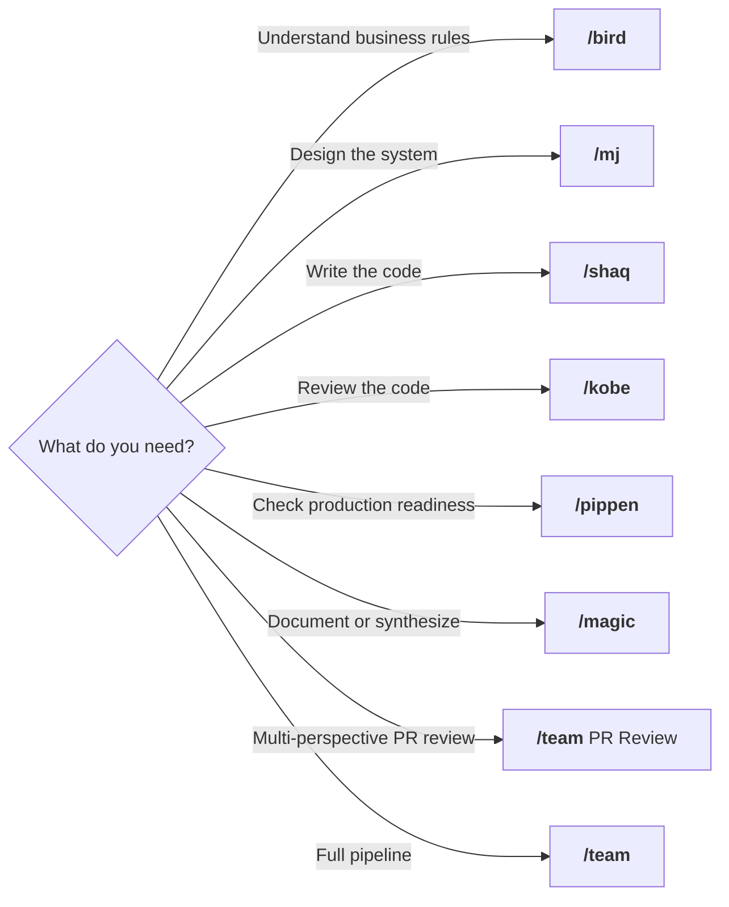
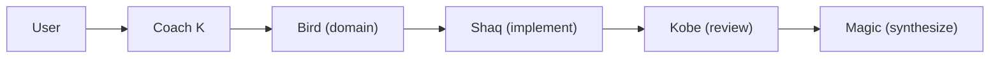
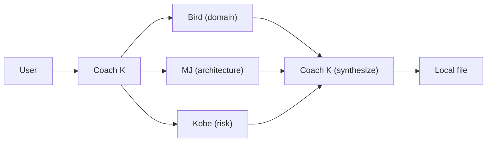
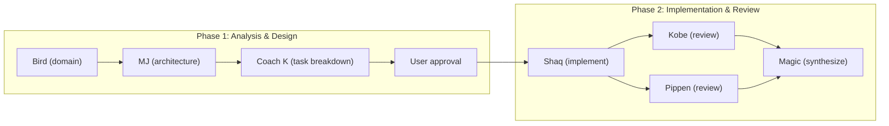

# Dream Team

Source of truth for all Claude Code agents and commands. Install once, use everywhere.

## What's in the box

**6 agents**, each with a matching `/command`, plus a `/team` orchestrator.

| Agent | Command | Persona | Role | Model | Max Turns |
|-------|---------|---------|------|-------|-----------|
| **bird** | `/bird` | Larry Bird | Domain Authority & Final Arbiter | **opus** | 50 |
| **mj** | `/mj` | Michael Jordan | Strategic Systems Architect | **opus** | 50 |
| **shaq** | `/shaq` | Shaquille O'Neal | Primary Code Executor | **opusplan** | 100 |
| **kobe** | `/kobe` | Kobe Bryant | Quality & Risk Enforcer | **opus** | 50 |
| **pippen** | `/pippen` | Scottie Pippen | Stability, Integration & Defense | sonnet | 50 |
| **magic** | `/magic` | Magic Johnson | Context Synthesizer & Team Glue | sonnet | 50 |

### Agent capabilities

Each agent has restricted tool access based on its role:

| Agent | Tools | Why |
|-------|-------|-----|
| bird | Read, Grep, Glob, Bash | Domain analysis + business impact assessment |
| mj | Read, Grep, Glob, Bash, WebFetch, WebSearch | Architecture + external research + health diagnostics |
| shaq | All except Task | Full implementer — writes code |
| kobe | Read, Grep, Glob, Bash, Edit | Quality review + can fix critical bugs directly |
| pippen | Read, Grep, Glob, Bash | Stability review — checks runtime |
| magic | Read, Grep, Glob | Synthesis only |

Agents with `memory: user` (kobe, magic) learn across sessions — remembering review patterns, failure modes, and past decisions.

## When to use each agent

### `/bird` — "Is this correct?"

Use Bird when you need to validate business logic or define what "right" looks like before writing code.

- "Are these pricing rules correct?"
- "What are the business rules for refund eligibility?"
- "Define acceptance criteria for the checkout flow"
- "What's the business impact of changing the order lifecycle?"
- "Who are the stakeholders affected by this migration?"

### `/mj` — "How should this be built?"

Use MJ when you need architecture decisions, system design, or health diagnostics on existing code.

- "Should we use event sourcing or CRUD for orders?"
- "Design the component boundaries for the notification system"
- "Our API response times are degrading — what should we investigate?"
- "Review the current architecture for technical debt"
- "What are the trade-offs between these two approaches?"

### `/shaq` — "Build it."

Use Shaq when you have a clear spec and need code written. He implements features, writes tests, and follows existing patterns.

- "Implement this API endpoint per the spec"
- "Add pagination to the user list"
- "Write tests for the discount calculation"
- "Refactor this service to use the repository pattern"
- "Create the database migration for the new schema"

### `/kobe` — "Is this safe to ship?"

Use Kobe when code is written and you need a ruthless quality review before deploying. He also checks production readiness and can fix critical bugs directly.

- "Review this PR for edge cases and race conditions"
- "This handles money — find every way it could break"
- "Is this ready to deploy? Check everything."
- "Review the error handling in the payment service"
- "Check if this migration is safe to run in production"

### `/pippen` — "Will this hold up in production?"

Use Pippen when you need to verify operational readiness — monitoring, observability, resilience, and integration between components.

- "Do we have enough logging to debug this at 3am?"
- "Check if the new service has proper health checks and metrics"
- "Review the retry/timeout configuration"
- "Can we roll this back safely?"
- "How do these three services interact under failure conditions?"

### `/magic` — "Summarize everything."

Use Magic when you need to synthesize multiple perspectives into clear documentation, ADRs, or handoff notes.

- "Summarize all the analysis and implementation work"
- "Document why we chose event sourcing over CRUD"
- "Create an ADR for the authentication redesign"
- "Write handoff notes for the next team"
- "What decisions were made and what's still open?"

### `/team` — "Get the whole squad on it."

Use `/team` when the task is too big for one agent. Coach K coordinates the full Dream Team — from domain analysis through implementation, review, and synthesis.

- **Quick Fix** (subagents): Bug fixes, small features, focused changes
- **PR Review** (subagents): Review a PR or branch — Bird + MJ + Kobe in parallel, output stays local
- **Full Team** (agent teams): New features, architecture changes, complex multi-file work

```
/team Add pagination to the user list           # Quick Fix territory
/team Review PR #1217                           # PR Review territory
/team Build a real-time notification system      # Full Team territory
/team Fix the race condition in checkout         # Quick Fix territory
```

### Decision tree



## /team — Coach K Orchestration

The `/team` command launches Coach K, who coordinates the Dream Team. You choose the mode:

### Quick Fix — Subagents (within session)

For bug fixes, small features, and focused changes. Sequential subagents, lower token cost.



1. **Bird** defines business rules and acceptance criteria
2. **Shaq** implements the code with tests
3. **Kobe** reviews for critical risks (max 3 findings)
4. **Magic** synthesizes everything into a summary

### PR Review — Subagents (parallel, local output)

For reviewing PRs or branches. 3 agents in parallel, all output stays local.



1. **Coach K** fetches PR data using read-only `gh` commands
2. **Bird + MJ + Kobe** review the diff in parallel (each gets the diff in their prompt)
3. **Coach K** synthesizes verdicts and writes to `analysis/PR-<number>-review.md`

**All `gh` commands are READ-ONLY.** Agents NEVER post comments, reviews, or modifications to GitHub. The review stays local — the user decides what to do with it.

**Read-only commands used:**
```bash
gh pr view <N> --json title,body,files,commits,statusCheckRollup   # PR metadata
gh pr diff <N> --patch                                              # Code changes
gh pr diff <N> --name-only                                          # Changed files list
gh pr checks <N> --json name,state,bucket                           # CI status
```

### Full Team — Agent Team (parallel sessions)

For new features, architecture changes, and complex multi-file work. Uses the experimental [agent teams](https://code.claude.com/docs/en/agent-teams) feature — 6 independent Claude Code sessions coordinated by Coach K via shared task list and inter-agent messaging.



1. **Bird** provides full domain analysis, messages MJ when done
2. **MJ** designs system architecture based on Bird's analysis
3. **Coach K** breaks work into tasks, presents plan for user approval
4. **Shaq** implements the full feature
5. **Kobe** + **Pippen** review in parallel (quality + stability)
6. **Magic** synthesizes all outputs into final documentation

**Requirements for Full Team mode:**
- Enable `CLAUDE_CODE_EXPERIMENTAL_AGENT_TEAMS` in settings.json or environment
- Higher token cost (6 independent sessions)
- If not enabled, Coach K falls back to the subagent workflow

### Git Safety

No agent ever commits or pushes. The user controls all git operations.

## Installation

### 1. Clone and install agents

```bash
git clone <this-repo> ~/Github/Bondarewicz/dreamteam
cd ~/Github/Bondarewicz/dreamteam
./install.sh
```

The installer:
1. Backs up existing `~/.claude/agents/` and `~/.claude/commands/`
2. Copies all 6 agent files to `~/.claude/agents/`
3. Copies all 7 command files to `~/.claude/commands/`
4. Removes old files (penny.md, guardian.md, etc.) if present

### 2. Enable agent teams (required for Full Team mode)

Agent teams are an experimental Claude Code feature that lets `/team` spawn 6 parallel sessions. Add this to your `~/.claude/settings.json`:

```json
{
  "env": {
    "CLAUDE_CODE_EXPERIMENTAL_AGENT_TEAMS": "1"
  }
}
```

Without this setting, `/team` still works but falls back to sequential subagents (Quick Fix mode only).

### 3. Restart Claude Code

Start a new session to pick up the agents, commands, and settings.

### Re-installing after changes

Edit agent/command files in this repo, then run `./install.sh` again. Previous files are backed up automatically.

## Repository Structure

```
dreamteam/
├── agents/                    # Agent definitions (6 files)
│   ├── bird.md                # Domain authority & business impact
│   ├── mj.md                  # Systems architect & health diagnostics
│   ├── shaq.md                # Code executor
│   ├── kobe.md                # Quality enforcer & production readiness
│   ├── pippen.md              # Stability & integration
│   └── magic.md               # Context synthesizer
├── commands/                  # Slash commands (7 files)
│   ├── mj.md                  # /mj
│   ├── bird.md                # /bird
│   ├── shaq.md                # /shaq
│   ├── kobe.md                # /kobe
│   ├── pippen.md              # /pippen
│   ├── magic.md               # /magic
│   └── team.md                # /team (Coach K orchestrator)
├── install.sh                 # Installer script
└── README.md
```

## Customization

All agents live in `agents/` as Markdown files with YAML frontmatter. Edit them directly.

**Frontmatter fields:**
- `name` — Agent identifier (used in `subagent_type` and agent team spawning)
- `description` — When Claude should use this agent (with examples)
- `model` — Claude model to use (`sonnet`, `opus`, `haiku`, `inherit`)
- `color` — Terminal output color
- `tools` — Allowlist of tools (inherits all if omitted)
- `disallowedTools` — Denylist of tools
- `memory` — Persistent memory scope (`user`, `project`, `local`)
- `maxTurns` — Maximum agentic turns before stopping

**Body:** The agent's system prompt — role, responsibilities, guardrails, output format.

After editing, run `./install.sh` to deploy changes.

## Models & Usage

### Model strategy

The Dream Team is configured quality-first, with each agent on the model that best matches its reasoning demands.

| Model | Agents | What it does | Why |
|-------|--------|-------------|-----|
| **opus** | bird, mj, kobe | Deepest reasoning | Domain analysis, architecture design, and bug-hunting need the most nuanced thinking |
| **opusplan** | shaq | Opus for planning, sonnet for execution | Deep reasoning when understanding specs, fast code generation when writing |
| **sonnet** | pippen, magic | Balanced reasoning + speed | Structured reviews and synthesis don't need opus depth |

### Available models

| Model | Reasoning | Speed | Code Gen | Context | Best for |
|-------|-----------|-------|----------|---------|----------|
| `opus` | Deepest | Moderate | Excellent | 200K | Complex analysis, subtle bugs, architecture |
| `opusplan` | Opus (plan) + Sonnet (execute) | Hybrid | Excellent | 200K | Implementation with smart planning |
| `sonnet` | Strong | Fast | Excellent | 200K | Daily coding, structured reviews |
| `haiku` | Good | Fastest | Very good | 200K | Simple tasks, high-volume operations |

### Model tuning guide

Start quality-first, then dial down where results are equivalent:

| If you notice... | Try... |
|-----------------|--------|
| Pippen's reviews are shallow | Upgrade pippen to `opus` |
| Magic's synthesis is fine but slow | Downgrade magic to `haiku` |
| Hitting rate limits on Full Team | Downgrade bird, mj to `sonnet` |
| Kobe's findings are obvious/shallow | Keep on `opus` — this is where depth matters most |
| Shaq's code quality is great | Could downgrade to `sonnet` (saves opus planning cost) |

To change a model: edit the `model:` field in `agents/<name>.md`, run `./install.sh`.

### Turn limits

Every agent has a `maxTurns` cap to prevent runaway sessions:

| Agent | maxTurns | Rationale |
|-------|----------|-----------|
| bird | 50 | Domain analysis — hypothesis-driven, finishes in ~26 turns |
| mj | 50 | Architecture — hypothesis-driven, finishes in ~28 turns |
| shaq | 100 | Implementation — writes code, runs tests, iterates on failures |
| kobe | 50 | Quality review — hypothesis-driven methodology, finishes in ~36 turns |
| pippen | 50 | Stability review — matches analysis agent budget |
| magic | 50 | Synthesis — reads outputs and writes summary |

All agents include a **Turn Budget Management** instruction that enforces hard limits: stop research at ~70% of turns and write output. This prevents agents from spending all turns on research without delivering a final analysis.

### Usage monitoring

Coach K includes a **Lineup Card** at the end of every `/team` run showing which agents ran on which models.

**Built-in commands you can run anytime:**
- `/usage` — rate limit status (Claude Max/Pro)
- `/cost` — token counts and estimated cost (API users)
- `/stats` — usage patterns and session history
- `/context` — how much of the context window is filled

Run `/usage` before and after a `/team` session to see the rate limit impact, then adjust agent models accordingly.

### Prompt caching

Claude Code automatically caches system prompts and long conversations. No configuration needed — repeated content (agent definitions, large file reads, prior context) gets cached at 90% savings on input tokens.

## Built-in Tension (by design)

The Dream Team has intentional creative tension:

- **Bird vs MJ** — correctness vs elegance
- **Kobe vs Shaq** — quality vs speed
- **Coach K vs everyone** — shipping vs perfection

This tension is productive. It prevents groupthink and ensures robust solutions.
