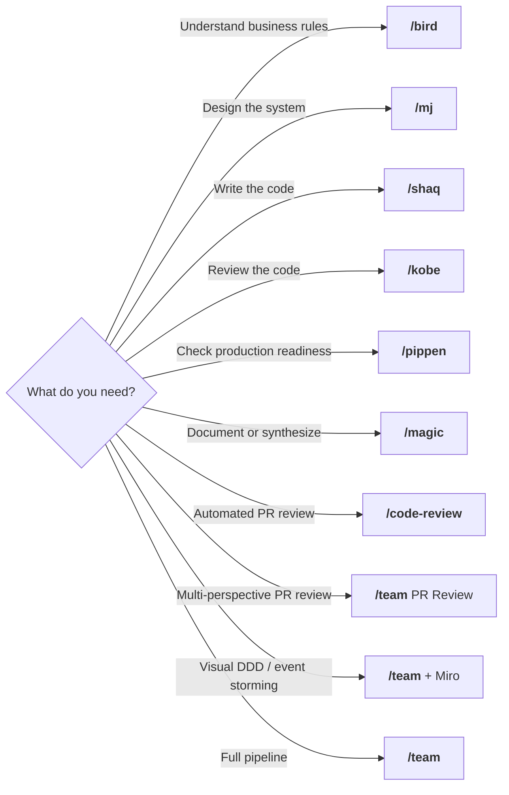
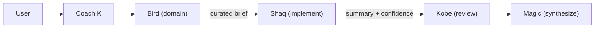
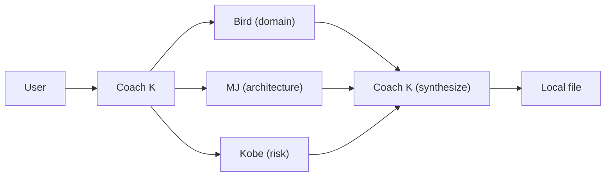
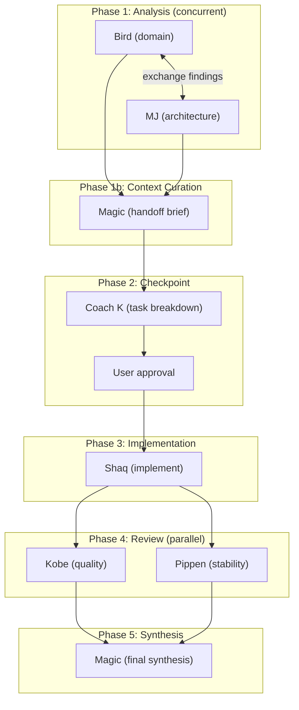

# Dream Team

Source of truth for all Claude Code agents and commands. Install once, use everywhere.

## What's in the box

**6 agents**, each with a matching `/command`, plus a `/team` orchestrator and `/code-review` for automated PR reviews.

| Agent | Command | Persona | Role | Model | Max Turns |
|-------|---------|---------|------|-------|-----------|
| **bird** | `/bird` | Larry Bird | Domain Authority & Final Arbiter | **opus** | 50 |
| **mj** | `/mj` | Michael Jordan | Strategic Systems Architect | **opus** | 50 |
| **shaq** | `/shaq` | Shaquille O'Neal | Primary Code Executor | **opusplan** | 100 |
| **kobe** | `/kobe` | Kobe Bryant | Quality & Risk Enforcer | **opus** | 50 |
| **pippen** | `/pippen` | Scottie Pippen | Stability, Integration & Defense | **opus** | 50 |
| **magic** | `/magic` | Magic Johnson | Context Synthesizer & Team Glue | sonnet | 50 |

### Agent capabilities

Each agent has restricted tool access based on its role:

| Agent | Tools | Why |
|-------|-------|-----|
| bird | Read, Grep, Glob, Bash | Domain analysis + business impact assessment |
| mj | Read, Grep, Glob, Bash, WebFetch, WebSearch | Architecture + external research + health diagnostics |
| shaq | All except Task | Full implementer — writes code |
| kobe | Read, Grep, Glob, Bash, Edit | Quality review + can fix critical bugs directly |
| pippen | Read, Grep, Glob, Bash | Stability review — checks runtime |
| magic | Read, Grep, Glob, Write, Edit | Synthesis + writes handoff briefs and retros to disk |

Agents with `memory: user` (kobe, magic) learn across sessions — remembering review patterns, failure modes, and past decisions.

### Key agent features

Every agent includes these cross-cutting capabilities:

- **Output Schema** — structured required fields that Coach K validates before handoffs. Prevents the #1 multi-agent failure mode: agents talking past each other due to freeform outputs.
- **Escalation Protocol** — agent-specific rules for when to stop and ask instead of guessing. Each agent knows what kinds of uncertainty warrant escalation to Coach K.
- **Confidence Assessment** — self-reported confidence level (0-100%), high/low confidence areas, and assumptions. Helps Coach K and downstream agents calibrate trust.
- **Turn Budget Management** — hard limits: stop research at ~70% of turns and write output. Prevents agents from spending all turns on research without delivering.

## When to use what



| Command | When to reach for it | Examples |
|---------|---------------------|----------|
| `/bird` | Validate business logic or define what "right" looks like | "Are these pricing rules correct?", "Define acceptance criteria for checkout" |
| `/mj` | Architecture decisions, system design, or health diagnostics | "Should we use event sourcing or CRUD?", "Diagnose our API latency" |
| `/shaq` | Clear spec, need code written | "Implement this endpoint per the spec", "Write tests for discount calc" |
| `/kobe` | Code is written, need ruthless quality review | "This handles money — find every way it could break" |
| `/pippen` | Verify operational readiness | "Do we have enough logging to debug at 3am?" |
| `/magic` | Synthesize perspectives into docs/ADRs | "Document why we chose event sourcing" |
| `/team` | Task too big for one agent | "Build a real-time notification system" |
| `/team` + Miro | Visual architecture & DDD | "/team analyze this Miro board and create event storming" |
| `/code-review` | Automated PR review | "/code-review 42" |

## /team — Coach K Orchestration

The `/team` command launches Coach K, who coordinates the Dream Team. Three modes:

### Quick Fix — Subagents (within session)

For bug fixes, small features, and focused changes. Sequential subagents, lower token cost.



1. **Bird** defines business rules and acceptance criteria (with output schema)
2. **Coach K** curates a focused brief for Shaq — only the domain rules, acceptance criteria, and terms needed
3. **Shaq** implements the code with tests, maps back to Bird's acceptance criteria
4. **Kobe** reviews for critical risks, guided by Shaq's low-confidence areas
5. **Magic** synthesizes everything with team metrics

Coach K curates context per agent rather than dumping all prior outputs. This prevents context bloat while ensuring each agent has exactly what they need.

**Fix-Verify Loop:** If Kobe reports findings, Coach K re-launches Shaq to fix, then Kobe to verify. No fixes are ever skipped.

### PR Review — Subagents (parallel, local output)

For reviewing PRs or branches. 3 agents in parallel, all output stays local.



1. **Coach K** fetches PR data using read-only `gh` commands
2. **Bird + MJ + Kobe** review the diff in parallel
3. **Coach K** synthesizes verdicts and writes to `docs/PR-<number>-review.md`

All `gh` commands are **READ-ONLY**. Nothing is ever posted to GitHub.

### Full Team — Agent Team (parallel sessions)

For new features, architecture changes, and complex multi-file work. Uses [agent teams](https://code.claude.com/docs/en/agent-teams) — 6 independent sessions coordinated by Coach K.



| Phase | Agents | What happens |
|-------|--------|-------------|
| **1. Analysis** | Bird + MJ (concurrent) | Bird defines domain rules while MJ designs architecture. They exchange findings via messages and adjust in real-time. |
| **1b. Context Curation** | Magic | Creates a curated handoff brief for Shaq — resolves terminology mismatches, flags contradictions, distills only what's needed for implementation. |
| **2. Checkpoint** | Coach K + User | Coach K saves checkpoint to `docs/checkpoint-<topic>.md`, breaks work into tasks, presents plan. User approves before implementation. |
| **3. Implementation** | Shaq | Implements from Magic's handoff brief. Must submit plan before writing code (plan mode enforced). Maps implementation back to acceptance criteria. |
| **4. Review** | Kobe + Pippen (parallel) | Kobe reviews quality/risk, Pippen reviews stability/ops. Both receive curated context, not raw dumps. |
| **4b. Fix-Verify** | Shaq → Kobe + Pippen | If reviewers find issues, Shaq fixes, then reviewers re-verify. Loop repeats until both say SHIP. |
| **5. Synthesis** | Magic | Final synthesis with team metrics: escalation count, confidence levels, finding attribution, fix-verify loop count. |

**Checkpointing:** Phase 1-2 outputs are saved to disk. If Phase 3 fails, earlier work is preserved — no need to re-run analysis.

**Escalation handling:** When any agent escalates (domain ambiguity, spec conflicts, missing context), Coach K routes to the right specialist or asks the user directly. Escalations are tracked in the retro.

**Requirements:**
- Enable `CLAUDE_CODE_EXPERIMENTAL_AGENT_TEAMS` in settings.json or environment
- If not enabled, Coach K falls back to Quick Fix subagent workflow

### Retrospectives

After every `/team` session, a checkpoint is saved to `docs/checkpoint-<topic>.md` with all agent outputs preserved for future sessions. Magic's synthesis captures the retro narrative including:

- Executive summary, agent contributions, decisions made
- **Team metrics:** escalation count, confidence levels per agent, finding attribution, fix-verify loop count, contradictions detected
- Standalone HTML retros are stored in `reports/retros/` for historical reference

### Git Safety

No agent ever commits or pushes. The user controls all git operations. Suggested git commands are provided in the final output.

## /code-review — Automated PR Review

Based on the [official Claude Code code-review plugin](https://github.com/anthropics/claude-code/tree/main/plugins/code-review), adapted for local-only output.

Launches 4+ parallel agents:
- **2x CLAUDE.md compliance agents** — check guideline adherence
- **2x bug detector agents** — find bugs and security issues in the diff
- **Validation agents** — verify each finding is real (reduces false positives)

All output stays in the terminal. Nothing is ever posted to GitHub.

```
/code-review 42        # Review PR #42
/code-review           # Review current branch's PR
```

## Installation

### 1. Clone and install

```bash
git clone <this-repo> ~/Github/Bondarewicz/dreamteam
cd ~/Github/Bondarewicz/dreamteam
./scripts/install.sh
```

The installer backs up existing files, then copies all agents to `~/.claude/agents/` and commands to `~/.claude/commands/`.

### 2. Enable agent teams (optional, for Full Team mode)

Add to `~/.claude/settings.json`:

```json
{
  "env": {
    "CLAUDE_CODE_EXPERIMENTAL_AGENT_TEAMS": "1"
  }
}
```

### 3. Restart Claude Code

Start a new session to pick up changes. After any edit, run `./scripts/install.sh` again.

## Repository Structure

```
dreamteam/
├── agents/                    # Agent definitions (6 files)
│   ├── bird.md                # Domain authority & business impact
│   ├── mj.md                  # Systems architect & health diagnostics
│   ├── shaq.md                # Code executor
│   ├── kobe.md                # Quality enforcer & production readiness
│   ├── pippen.md              # Stability & integration
│   └── magic.md               # Context synthesizer & handoff curator
├── commands/                  # Slash commands (9 files)
│   ├── bird.md, mj.md, shaq.md, kobe.md, pippen.md, magic.md
│   ├── team.md                # /team (Coach K orchestrator)
│   ├── eval.md                # /eval (eval runner + Coach K scoring)
│   └── code-review.md         # /code-review (automated PR review)
├── scripts/
│   └── install.sh             # Installer script
├── docs/                      # Markdown docs, analysis, checkpoints
│   ├── team-improvement-analysis.md
│   └── claude-skillz-analysis.md
├── evals/                     # Eval scenarios, results, and TypeScript runner
│   ├── src/                   # TypeScript eval infrastructure
│   │   └── cli.ts             # Eval CLI entry point (bun evals/src/cli.ts)
│   ├── <agent>/scenario-*.md  # 20-25 scenarios per agent (125 total)
│   └── results/*.json         # Eval run results (append-only)
├── reports/
│   ├── retros/                # Session retro HTML reports
│   └── evals/                 # Eval HTML dashboards
├── web/                       # Web-based eval report viewer (Bun server)
│   ├── index.ts               # Entry point — Bun.serve on port 3000
│   ├── src/                   # Route handlers and router
│   ├── static/                # Static assets (htmx)
│   └── package.json           # Scripts: start, dev
└── README.md
```

## Web-Based Evaluation Report Viewer

The `web/` directory contains a lightweight Bun server that serves eval results as a browsable dashboard. It reads directly from the SQLite database (`data/dreamteam.db`) and auto-migrates JSON eval results into the database on first run — no manual database setup required.

**Prerequisites:**
- [Bun](https://bun.sh) — `curl -fsSL https://bun.sh/install | bash`
- [SQLite](https://www.sqlite.org/download.html) — included on macOS; on Linux install via `apt install sqlite3` or `brew install sqlite`

### Start the server

```bash
cd web
bun install
bun run start
```

The server starts on port 3000 and opens your browser automatically at `http://localhost:3000`.

### Dev mode (hot reload)

```bash
cd web
bun run dev
```

This runs `bun --hot index.ts`, which reloads the server on file changes — useful when modifying routes or templates.

### Change the port

If port 3000 is in use, set the `PORT` environment variable before starting:

```bash
cd web
PORT=8080 bun run start
```

### First-run auto-migration

On startup, if the SQLite database is empty, the server automatically imports all existing JSON eval results from `evals/results/`. No manual migration step is needed — just start the server and the data will be there.

## Anthropic Workbench Export

Eval scenarios can be exported to [Anthropic Workbench](https://platform.claude.com/workbench) for batch evaluation with different models, system prompts, or temperature settings.

```bash
# Export a single agent's scenarios to CSV
bun evals/src/workbench-export.ts bird

# Export all agents (one CSV per agent)
bun evals/src/workbench-export.ts --all

# Include scoring rubric as a grading prompt column
bun evals/src/workbench-export.ts bird --with-rubric
```

Output: `evals/<agent>/workbench-import.csv`

In Workbench: set System Prompt to the agent definition (`agents/<name>.md`), set User Message to `{{scenario_input}}`, then import the CSV under the Evaluate tab. See `evals/README.md` for the full step-by-step workflow.

## Models & Tuning

### Model strategy

Quality-first, with each agent on the model matching its reasoning demands.

| Model | Agents | Why |
|-------|--------|-----|
| **opus** | bird, mj, kobe, pippen | Domain analysis, architecture, quality review, and stability review all require deep reasoning |
| **opusplan** | shaq | Opus for planning, sonnet for code generation |
| **sonnet** | magic | Synthesis is structured and doesn't need opus depth |

### Tuning guide

| If you notice... | Try... |
|-----------------|--------|
| Magic's synthesis is fine but slow | Downgrade magic to `haiku` |
| Hitting rate limits on Full Team | Downgrade bird, mj to `sonnet` |
| Kobe's findings are obvious/shallow | Keep on `opus` — quality is where depth matters most |
| Pippen's reviews are excellent | Could downgrade to `sonnet` to save rate limits |
| Shaq's code quality is great | Could downgrade to `sonnet` (saves opus planning cost) |

To change a model: edit `model:` in `agents/<name>.md`, run `./scripts/install.sh`.

### Turn limits

| Agent | maxTurns | Rationale |
|-------|----------|-----------|
| bird | 50 | Domain analysis — finishes in ~26 turns |
| mj | 50 | Architecture — finishes in ~28 turns |
| shaq | 100 | Implementation — writes code, runs tests, iterates |
| kobe | 50 | Quality review — hard stop at turn 25 for output |
| pippen | 50 | Stability review — matches analysis budget |
| magic | 50 | Synthesis — reads outputs and writes summary |

### Model and Thinking Configuration

| Agent | Model | Effort Level | Rationale |
|-------|-------|--------------|-----------|
| bird  | opus  | high         | Domain analysis benefits from deep reasoning |
| mj    | opus  | high         | Architecture trade-offs require extended thinking |
| kobe  | opus  | high         | Code review requires thorough pattern matching |
| pippen| opus  | high         | Stability review requires thorough integration and operational analysis |
| shaq  | opusplan | medium    | Implementation is execution-heavy, not reasoning-heavy |
| magic | sonnet| low          | Synthesis is structured writing, not complex reasoning |

> **Warning:** Do NOT set `CLAUDE_CODE_DISABLE_ADAPTIVE_THINKING=1`. Adaptive thinking is active by default and allows the model to dynamically scale its thinking budget. Disabling it removes a meaningful quality lever with no compensating benefit.

### Usage monitoring

Coach K includes a **Lineup Card** at the end of every `/team` run. Use `/usage` before and after a session to see rate limit impact.

## Miro Integration

The Dream Team integrates with [Miro](https://miro.com) as a first-class collaboration surface via MCP. Agents can read board context, create diagrams, write documents, and build tables — turning analysis into visual artifacts without leaving the workflow.

### What agents can do on Miro

| Capability | Tool | Use case |
|-----------|------|----------|
| **Read board context** | `context_get`, `context_explore` | Understand existing diagrams, frames, and documents before analysis |
| **Create diagrams** | `diagram_create` | Flowcharts, UML sequence, UML class, and ER diagrams |
| **Write documents** | `doc_create`, `doc_update` | Domain catalogs, decision logs, hot spots, process documentation |
| **Build tables** | `table_create`, `table_sync_rows` | Structured data like event catalogs, service inventories, risk matrices |
| **Read images** | `image_get_data`, `image_get_url` | Analyze mockups, screenshots, or existing visual artifacts |

### How it works with /team

In a `/team` session, Coach K coordinates agents to both analyze and update Miro boards:

1. **Bird** reads the board to understand existing architecture, then produces domain analysis (bounded contexts, domain events, business rules)
2. **MJ** reads the board for system context, then produces architectural decisions (service decomposition, event flows, CQRS boundaries)
3. **Coach K** synthesizes their findings and creates visual artifacts on the board:
   - Event storming flowcharts with DDD color coding
   - Service decomposition diagrams with infrastructure mapping
   - Sequence diagrams for sagas and process flows
   - Document cards for domain event catalogs, hot spots, and migration plans

### Setup

Three commands to get started:

```bash
# Step 1 — Add the Miro MCP server
claude mcp add --transport http miro https://mcp.miro.com

# Step 2 — Verify it was added
claude mcp list
# You should see:
#   miro: https://mcp.miro.com (HTTP) - ! Needs authentication

# Step 3 — Authenticate
claude mcp authenticate miro
# This opens Miro in your browser — log in and select which team the MCP server can access
```

After authenticating, the Miro tools are available in all Claude Code sessions. The MCP server handles token refresh automatically — no API keys to manage.

### Example: DDD Event Storming from Architecture Diagram

The [demo board](https://miro.com/app/board/uXjVGp3Xb4A=/) was created by running Bird + MJ against **MJ Eval Scenario 05 — Microservices Decomposition** (a courier platform with 8 engineers, 5K writes/sec location tracking, strict payment consistency). The board started with a generic web architecture diagram; the Dream Team added all DDD event storming artifacts:

```
/team come up with implementation plan for https://miro.com/app/board/uXjVGp3Xb4A=/
```

This reads the board, launches Bird + MJ for domain and architecture analysis, then updates the board with:
- Process-level event storming flowchart (commands, aggregates, events, policies per bounded context)
- Service decomposition diagram with team topology (4 services for 8 engineers)
- Saga sequence diagram showing the full order-payment-delivery lifecycle
- Document cards for domain events catalog, hot spots, and migration strategy

## Built-in Tension (by design)

The Dream Team has intentional creative tension:

- **Bird vs MJ** — correctness vs elegance
- **Kobe vs Shaq** — quality vs speed
- **Coach K vs everyone** — shipping vs perfection

This tension prevents groupthink and ensures robust solutions.
